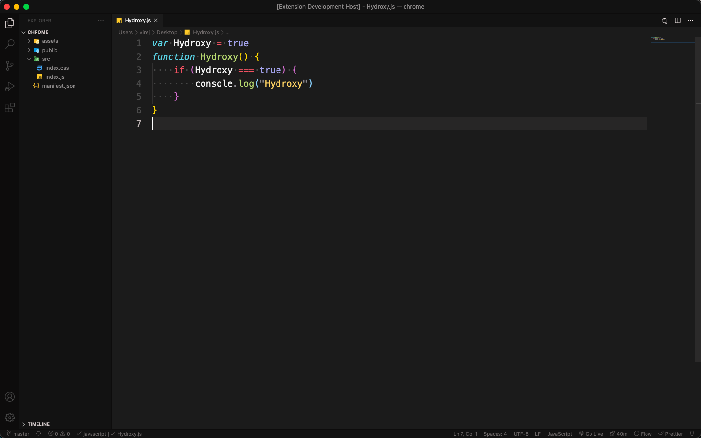

# Hydroxy

A [Visual Studio Code](https://code.visualstudio.com/) theme with dark colors inspired by [Bear App](https://bear.app/) colors, GitHub color scheme and [Monokai Pro](https://monokai.pro/).

_Font is Fantasque Sans Mono 15 with ligatures._

## Motivation

I wanted a theme with a dark window based on GitHub syntax color scheme because it is simple and consistent. Red and Black is always a great combo.

## Installation

1. Install Visual Studio Code
2. Launch Visual Studio Code
3. Choose Extensions from menu
4. Search for **hydroxy**
5. Click Install to install it
6. Click Reload to reload the Code
7. From the menu bar click: `Code > Preferences > Color Theme > Hydroxy`

Visual Studio Code Marketplace [link](https://marketplace.visualstudio.com/items?itemName=greven.hydroxy).

## Tasks

- [ ] Implement alternative dark blue theme
- [ ] Implement a light theme

## Issues

This is a work in progress, any issues with the theme or tweaks to the languages tokens, please use [GitHub issues](https://github.com/greven/hydroxy-vscode-theme/issues).
